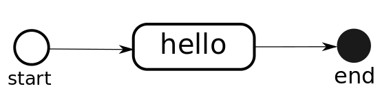

.. _quick_tour:

==================
Quick Tour of DaCE
==================

Introduction to business processes
==================================
In a company, a product is usually the result of a sequence of actions, according to business rules, performed by professional actors. The sequence of these actions is called a business process. Some of these actions can be automated in order to simplify the interaction of the different actors with data.

Processes in DaCE
-----------------
In DaCE, a process is a set of nodes interconnected by oriented transitions (see Fig 1). These nodes can be actions, events or gateways. 

    
    Fig 1: Hello process example

DanCE implement a set of concepts introduced in the BPMN standard. For more informtion about actions, events or gateways see `BPMN Specification - Business Process Model and Notation <http://www.bpmn.org/>`_.

DaCE enables the definition and execution of complex processes. It provide an API to manage processes and their nodes.

Installation
============

Add `ecreall_dace` in `install_requires` in your `setup.py`.
and edit `production.ini` in your Pyramid application to add::

    pyramid.includes =
        ...
        dace

Hello World
===========

Applications have shown that learning starts best from a very small first step. Here’s a tiny process definition in DaCE (see Fig 1):

.. literalinclude:: quick_tour/hello_world/app.py
    :linenos:
    :language: python

This simple example is easy to run. Save this as ``process_definition.py`` in yor Pyramid application and run it.

Next open http://localhost:6543/my_process in a browser, and you will see the ``Hello
World!`` message.

New to DaCE? If so, some lines in the module merit explanation:

#. *Step 1 - Line 19*. The ``ElementaryAction`` is one of multiple behavior type in DaCE. This type of behavior is executed only one time in the process instance. See :ref:`Behaviors types <behaviors_types>` for more information.

#. *Step 1 - Line 20*. The behavior is executed only on objects that implement the ``context``.

#. *Step 3 - Line 63*. ``getAllBusinessAction`` enable to recuperate all of behaviors in all of process instances for a given object. For more information about the DaCE utilities see :ref:`DaCE utilities <dace_utilities>`

.. seealso::
   :ref:`Quick Tutorial Hello World <qtut_hello_world>`

Conclusion
==========
